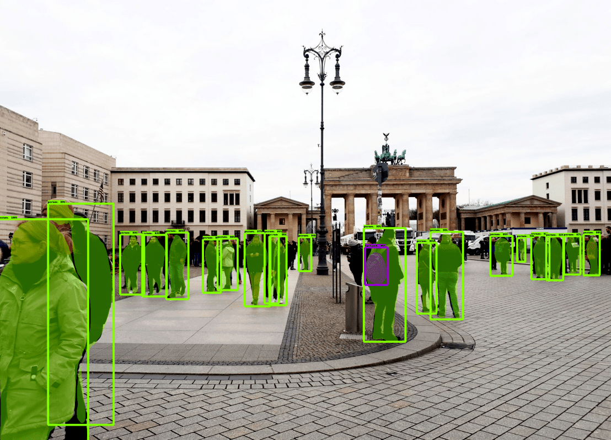

<h1  align=center>Image Segmentation with Mask R-CNN</h1>

 

<small>Picture Source:<a  href="https://github.com/doguilmak"> Doğu İlmak</a></small>

 

<h2>Content</h2>

You will see how to use a <i><a  href='https://arxiv.org/abs/1703.06870'>Mask R-CNN</a></i> model from <i>TensorFlow Hub</i> for <i>object detection</i> and </i>instance segmentation</i>. This means that aside from the <i>bounding boxes</i>, the model is also able to predict <i>segmentation masks</i> for each instance of a class in the image. In this repository, we are going to use photos that I selected from the photos I took in the cities I visited. You can use my pictures of the cities (Berlin, Budapest, Gdańsk, Kraków, Olsztyn, Oslo, Prague and Warsaw) for image segmentation. In addition, I would like to thank <b>Laurence Moroney</b>. I gained most of the knowledge I have gained thanks to him. I have endless respect to you.

 

<h2>References</h2>

<ol>
	<li><a href="https://laurencemoroney.com/">Laurence Moroney</a></li>
	<li><a href="https://www.coursera.org/learn/advanced-computer-vision-with-tensorflow#instructors">Advanced Computer Vision with TensorFlow</a></li>
	<li><a href="https://github.com/tensorflow/models">TensorFlow GitHub</a></li>
</ol>

 

<h2>Keywords</h2>

<ul>
	<li>Mask R-CNN</li>
	<li>Image Segmentation</li>
	<li>Instance Segmentation</li>
	<li>Computer Science</li>
	<li>Inception ResNet V2 1024x1024</li>
</ul>

 

<h2>Segmentation</h2>

<h3>Image Without Segmentation</h3>

	

 

<h3>Image With Segmentation</h3>

	 

 

<h2>Contact Me</h2>

If you have something to say to me please contact me:

<ul>
	<li>Twitter: <a href="https://twitter.com/Doguilmak">Doguilmak</a></li>
	<li>Mail address: doguilmak@gmail.com</li>
</ul>
